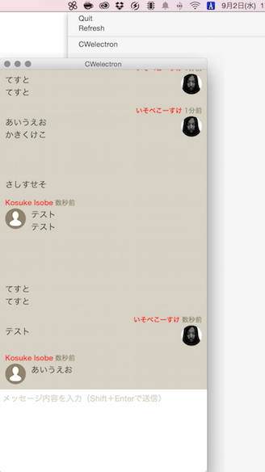

# CWelectron

* ChatWork を見る＆書き込むだけのデスクトップアプリです
* タスクとかは生のデータが表示されちゃいます
* Electron 使っています
* 無駄に React.js 使っています
* ChatWork の API token が必要です



## 使い方

レポジトリをクローンして必要なパッケージをインストールします。

```sh
$ git clone git@github.com:k0sukey/CWelectron.git
$ cd CWelectron
$ npm install
```

package.json に ChatWork の API token を追加します。

```js
{
	...
	"chatwork": "CHATWORK_API_TOKEN"
}
```

とりあえず動かしてみましょう。

```sh
$ npm start
```

上手く動いたらパッケージ化します。
packages フォルダにプラットフォーム毎のバイナリが作られます。

```sh
$ npm run package
```

## 注意事項

タイムラインの更新ですが、そもそも、API にストリームがありませんので、```setInterval(function(){}, 10000);``` とかしています。適宜調整してください。チャットワークさんのサーバの負担になるようでしたら、更新ボタンとかつけるかもです。

自分用なのでアイコンはモノクロにして切り取っていますが、ロゴのガイドラインに違反しちゃいそうなので「C」で同梱しています。お好きな画像にどうぞ。

もともと nw.js で作っていたのですが、Electron もトレイ周りがかっちょよくなっていたので、こちらで書き直しました。

## お礼

パッケージ化のところは [k0kubun/Nocturn](https://github.com/k0kubun/Nocturn) を参考にさせていただきました。
ありがとうございます。

## ライセンス

MIT